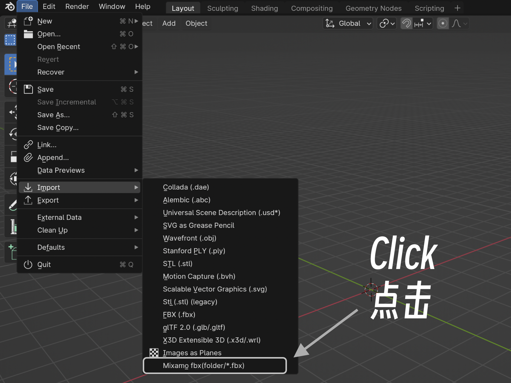
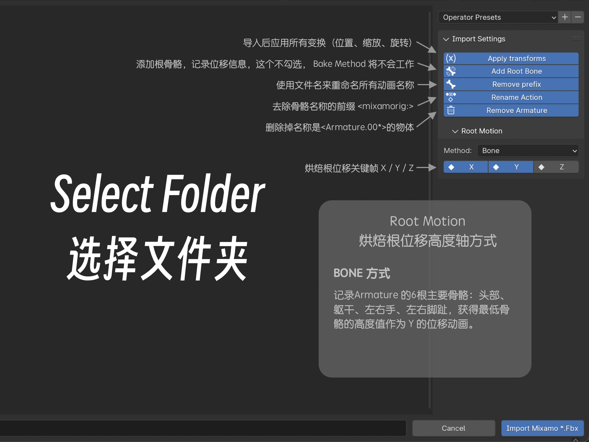
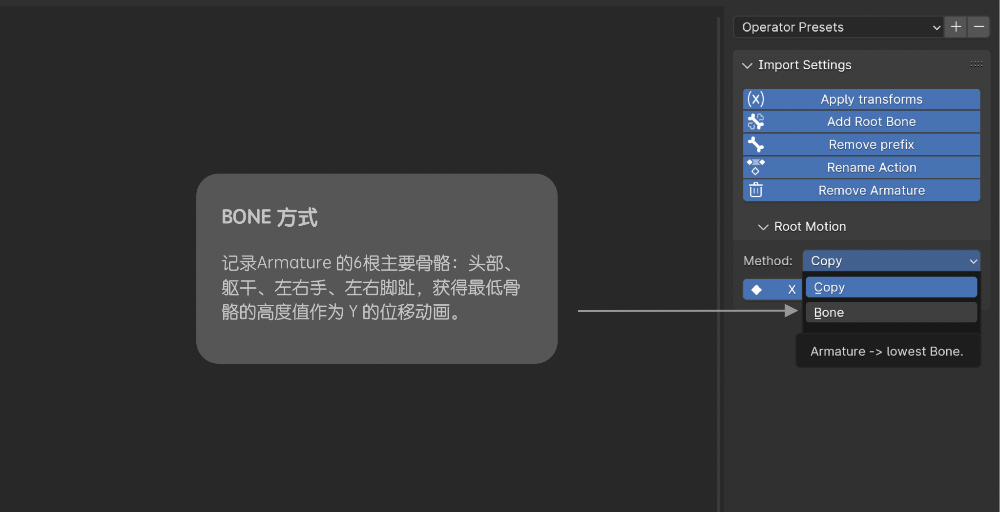
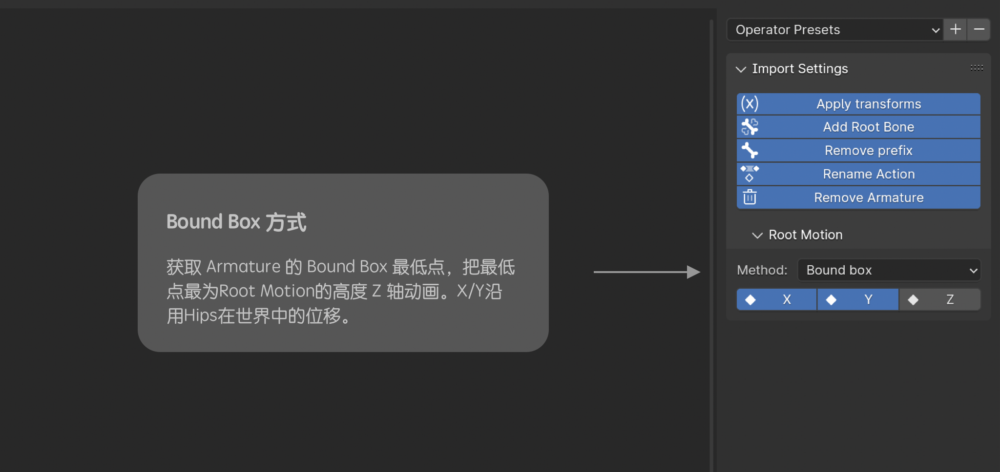
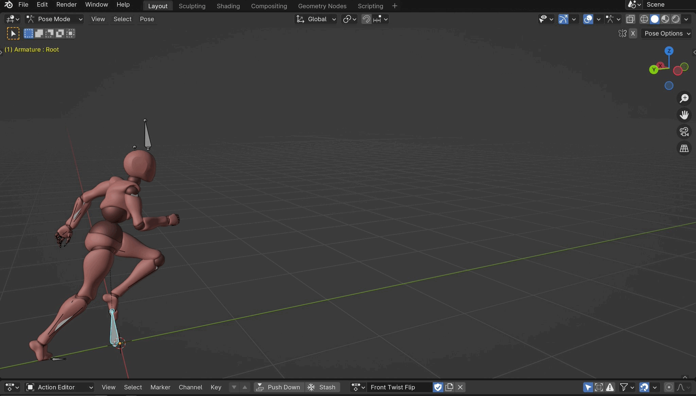

# import mixamo - root motion
这是一个blender插件，用来批量导入Mixamo.com下载的fbx文件，并可创建一个根骨骼记录位移信息。
`blender` `add-ons` `batch import` `fbx` `mixamo.com ` `root motion` 

## Better Root Motion
Root Motion将会对坐标系进行映射，使 Hips 和 Root 骨骼在同一个坐标系下，再进行位移信息的烘焙，Hips 骨头会根据烘焙的轴向对动画进行修正。最终使得烘焙 Root Motion 后的动画与原动画（Mixamo.com）下载的一致。
**⚠️ Root Motion 功能是会修改动画Hips骨头的关键帧(记录修正位移)**

> 骨骼的关键帧动画使用的是（Local）局部空间坐标系，默认创建的根骨骼y轴朝上，与（Global）世界坐标系Z轴重合。所以直接复制 Hips 骨骼的关键帧到根骨骼，并不是很好的解决方案。
在 Hips 骨骼有旋转角度的时候，旋转角度与世界z轴夹角越大，和原动画的就误差越大。

## 功能：
- 批量导入Fbx文件
- 批量去除前缀名称 "mixamorig:"
- 批量重命名动画名称，以文件名命名
- 批量应用所有变换并修复动画强度
- 批量移除多余的骨架和物体 "Armature.00*"
- 创建根骨骼记录位移信息
- Root Motion 提供了两种方式烘焙根位移的高度轴到根骨骼

## 使用方法：
1. 安装Blender 4.10或更高版本。
2. 下载并安装该插件。
3. 打开Blender，选择“文件”>“导入”>“Mixamo Fbx(floder/*.fbx)”。
4. 在打开的对话框中，选择动画文件的文件夹，右侧面板进行设置，点击导入“Import Mixamo *.Fbx”。

搞掂！
坐翻低、饮啖茶、吃个包 🍵🫖🍞
