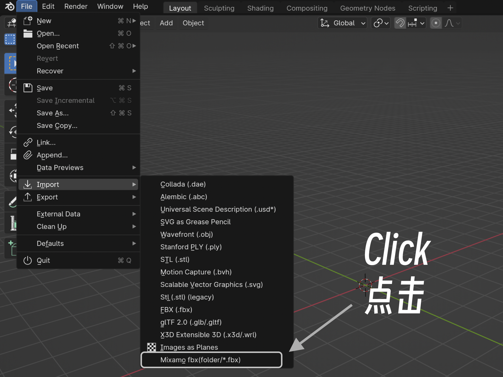
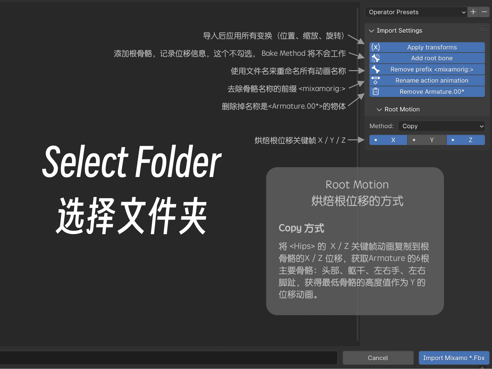
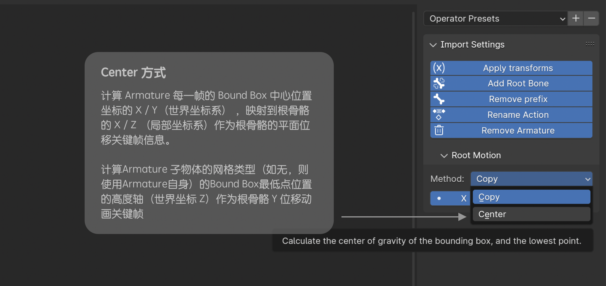
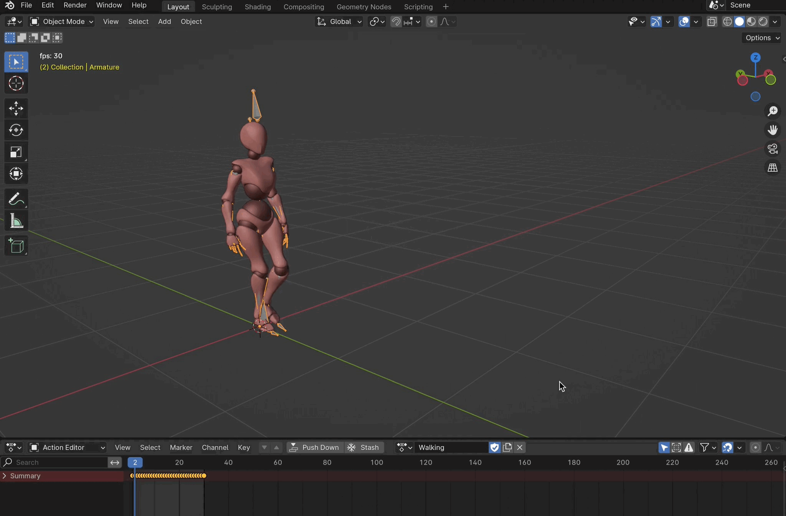

# import mixamo - root motion
这是一个blender插件，用来批量导入Mixamo.com下载的fbx文件，并可以创建一个根骨骼记录位移信息。
batch import mixamo.com fbx, root_motion, blender add-ons.

## 使用方法：
1. 安装Blender 4.10或更高版本。
2. 下载并安装该插件。
3. 打开Blender，选择“文件”>“导入”>“Mixamo Fbx(floder/*.fbx)”。
4. 在打开的对话框中，选择动画文件的文件夹，右侧面板进行设置，点击导入“Import Mixamo *.Fbx”。

搞掂！  
🍺🍺🍺