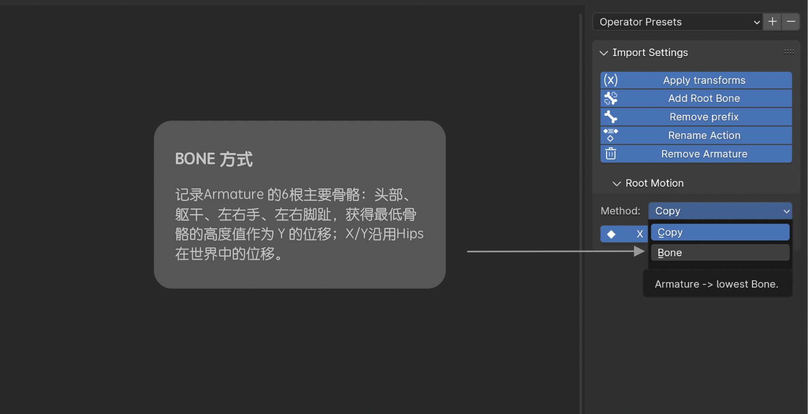

# import mixamo - root motion
这是一个blender插件，用来批量导入从 Mixamo.com 下载的fbx动画文件。 创建根骨骼烘焙 Root Motion （根位移）。  

## 功能
- 批量导入Fbx文件
- 批量去除前缀名称 "mixamorig:"
- 批量重命名动画名称，以文件名命名
- 批量应用所有变换并修复动画强度
- 批量移除多余的骨架和物体 "Armature.00*"
- 批量创建根骨骼，用以记录Root Motion信息
- Root Motion 提供了几种计算方式烘焙关键帧

## Root Motion
Root Motion 将角色位移烘焙到`Root`骨骼并将它作为父级，烘焙后的动画会与原动画（Mixamo.com下载的）保持一致。  
**⚠️ Root Motion 功能是会修改动画Hips骨头的关键帧(用来记录修正位移)**

 为什么需要修正动画

· 骨骼的关键帧动画使用的是 Local 局部空间坐标系。 
·   mixamo.com  的动画记录位移信息的是Hips骨骼，可能有一定旋转角度。 
· 而创建的Root骨骼自身Y轴与世界Z轴重合。 
· 当两个骨骼局部空间坐标系不重合时，夹角越大误差越大。 
· 这里把骨骼都转化为 Global 全局空间坐标系，再进行根骨骼动画的计算，最后转化为各个骨骼的 Local 局部空间坐标系进行关键帧烘焙。 
· 当没有对X/Y/Z三个轴都烘焙时，需要对动画进行修正。

## 使用方法
1. 安装Blender 4.1.0 或更高版本。
2. 下载并安装该插件。
3. 打开Blender，选择“文件”>“导入”>“Mixamo Fbx(floder/*.fbx)”。
4. 在打开的对话框中，选择动画文件的文件夹，右侧面板进行设置，点击导入“Import Mixamo *.Fbx”。

## 演示说明

搞掂！
坐翻低、饮啖茶、吃个包 🍵🫖🍞
